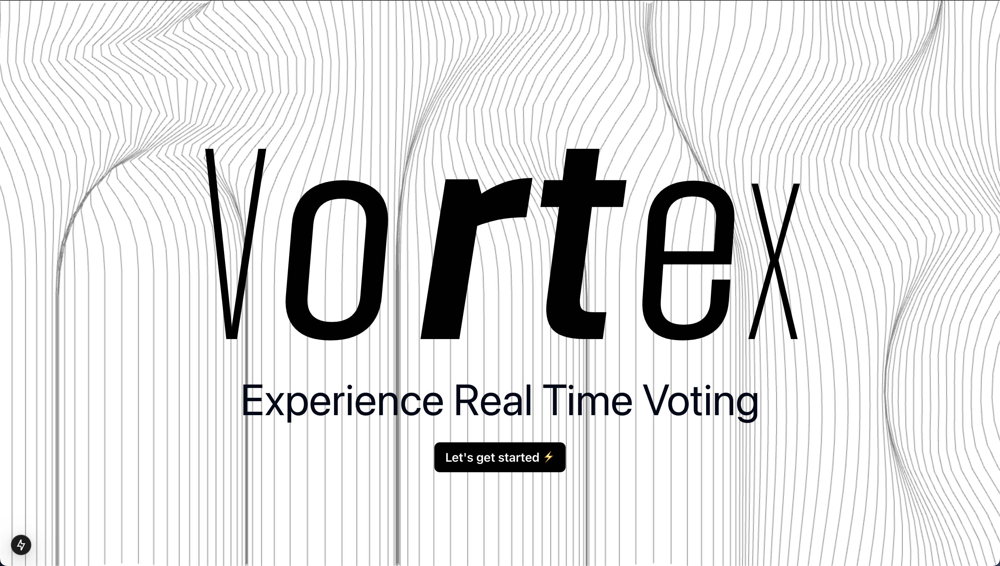

<div align="center">

#  Vortex ⚡️


### Experience Real-Time Voting Like Never Before

[](https://nextjs.org/)
[](https://reactjs.org/)
[](https://www.typescriptlang.org/)
[](https://tailwindcss.com)

</div>

## ✨ Features

- 🎯 **Real-Time Voting** - Experience instant vote updates
- 🎨 **Interactive UI** - Beautiful wave animations and pressure-sensitive text
- 🔒 **Secure Authentication** - Robust user authentication system using Passkeys🔑
- 📱 **Responsive Design** - Seamless experience across all devices
- ⚡ **Lightning Fast** - Built with Next.js for optimal performance

## 🚀 Quick Start

1. **Clone and Install**
```bash
git clone https://github.com/yourusername/vortex.git
cd vortex
npm install
```

2. **Set Up Environment**
```bash
cp .env.example .env.local
# Configure your environment variables
```

3. **Run Development Server**
```bash
npm run dev
```

Your app will be running at [http://localhost:8000](http://localhost:8000)! 🎉

## 🛠️ Tech Stack

- **Frontend Framework**: Next.js 15.1.7
- **UI Library**: React 19.0.0
- **Styling**: TailwindCSS
- **Animations**: React Spring
- **Components**: Shadcn UI
- **Charts**: Recharts
- **Date Handling**: date-fns
- **Notifications**: Sonner

## 🤝 Contributing

We love contributions! Please see our [Contributing Guide](CONTRIBUTING.md) for details.

## 📝 License

This project is licensed under the MIT License - see the [LICENSE](LICENSE) file for details.

<div align="center">

### Made with ❤️ by the Vortex Team

[Website](https://vortex-voting.com) · [Documentation](https://docs.vortex-voting.com) · [Report Bug](https://github.com/yourusername/vortex/issues)

</div>
